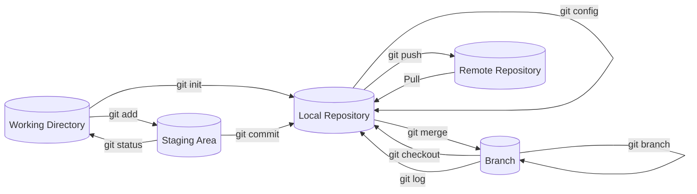

### **Developer Tools**

- Web Browser - [Microsoft Edge](https://www.microsoft.com/sv-se/edge?form=MA13FJ)
  - Used for generall research and to install new developer tools.
- Code Editor - [Visual Studio Code](https://code.visualstudio.com/)
  - Visual Studio Code is a code editor redefined and optimized for building and debugging modern web and cloud applications.
- Source Control Manager - [GitHub](https://github.com/)
  - Github is a web-based and centralized version history repository for software development projects that use the Git version management system.
- Virtual Machine - [oracle vm virtualbox](https://www.virtualbox.org/)
  - Virtual machine, virtual computer, is a virtual environment created through software. This virtual environment is seen by the programs running in the environment as if it were the real hardware.
- Code Liberary - [NPM](https://www.npmjs.com/)

### **Documentation**

In the prosses of downloading followed the steps with no issues until step 3 where I got the issue that I couldn't download the ISO image of Windows 11. The problem was solved by having a college sent me a link he was able to aquire.
 

Soon after the first issue another one appeared where I had to restart the computer and change the CPU settings to enable the VM to work.

### **10 important local Git commands**

1. Git add
   - Git hub is used when you want to add new or change pre-existing files in your working directory.
2. Git commit
   - Git commit save your latest changest in your working directory. It creates a history of your coding progress, which make it easier to follow your train of thought when coding if someone where to look back on it.
3. Git config
   - The git config command is used to edit user data, whit that being user.name and user.email. Changeing the settings in git config with a --global flag edit settings on all repositories on the computer. Git config can also be used to change behaviour of git status.
4. Git log
   - The git log command shows the chronological commit history of a repository. It can be a useful tool to use when picking up an old project or someone elses code to get context to how the code was built.
5. Git checkout
   - Git checkout is used to navigate between branches.
6. Git branch
   - Git branch is used to create, list, rename and delete branches.
7. Git merge
   - This command is used to integrate branches, combine the changes done from one branch to another branch and then merge them togrther.
8. Git clone
   - Git clone is used when you want to clone a branch of a or a whole repository to your local working directory.
9. Git status
   - Git status is always a good command to use when in doubt of what you haven't commitad yet. It shows the current stage of your git working directory and staging area.
10. Git init

- The command is used to turn a directory to a repository.

### **Working with git as a team**

Beinga able to work on a project together with others is amazing as you can devide the workload and get things done faster. The way you do it is by having one remote repository that everyone freequently push and pull to from their local and cloned repository. However there are some problems you and your team might run into which are important to be aware about.
 

The main problem you'll run into when working together on a project is **_merge conflicts_**. They appear when you have branches with competing commits. When they happen, Git needs your help to decide which changes to incoporate in the final merge. Luckily you are able to resolve merge conflicts without much of a hassel.
 

Merge conflicts can be **_resolved_** in your code editor such as Visual Studio Code but it is also be good to understand how to resolve merge conflicts in Git using the command line.
 

To resolve the merge conflict in Git command line you have to open Git Bash and navigate into the local Git repository that has the merge conflict. Once in the repository that's affected by the merge conflict it you will have to generate a list of files affected by the merge conflict. After decided which changes too incoporate in the final merge you'll have to stage your changes and commit the with a comment. The merge confict will then be solved and the changes will be sent to the remote repocitory on GitHub.
 
